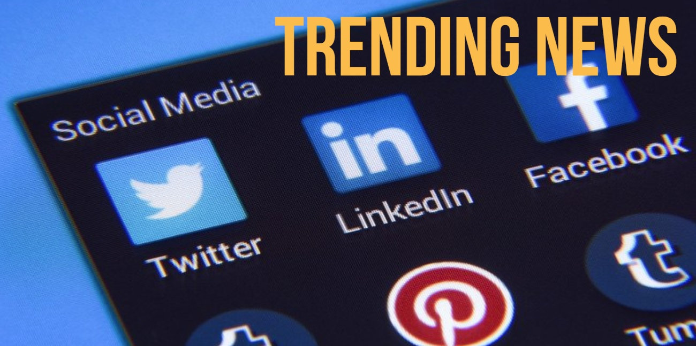
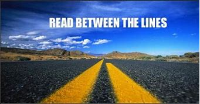

>## *Natural Language Processing with Bing News & Social Media*  

>## **Draw meaningful insights from social media posts & trending news articles** 
#

 

#

>### Overview: 
>> This script will call Bing News for trending articles & Twitter for social media posts for NLP analysis 

>> Final results display main takeaways for desired topic (topic = User input)

 

>## Meaningful, Actionable Insights
> [Real world application](https://getthematic.com/insights/how-to-get-actionable-insights-from-your-customer-feedback-analysis/#:~:text=Actionable%20insights%20are%20meaningful%20findings%20that%20result%20from,data-informed%20decisions.%20Not%20all%20insights%20are%20actionable%20though.): Actionable insights are meaningful findings that result from analyzing data. They make it clear what actions need to be taken or how one should think about an issue. Organizations use actionable insights to make data-informed decisions.

>

 
